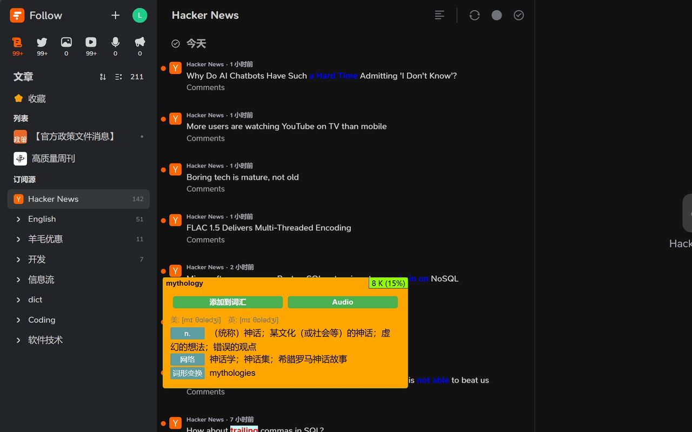

<p align="center">
<a href="https://github.com/Leon406/word-discoverer-ng/actions/workflows/webpack.yml"></a>
</p>

<p align="center">
 
</p>


[Chrome 扩展](https://chromewebstore.google.com/detail/%E5%8D%95%E8%AF%8D%E5%8F%91%E7%8E%B0%E8%80%85-ng/oikgdogigcinjcpjpahpgekgbimjgcce)
  
  
  

[Microsoft Edge 扩展](https://microsoftedge.microsoft.com/addons/detail/%E5%8D%95%E8%AF%8D%E5%8F%91%E7%8E%B0%E8%80%85ng/kdphfeabhlflpbeapflpkipohibphhgn)

[手动安装](https://github.com/Leon406/word-discoverer-ng/actions/workflows/webpack.yml) 


# Chrome Extension: Word Discoverer Next Generation

## Description

```
高亮网页上罕见的英语字典词汇和习语。促进英语语言学习并扩大词汇量。

相关特性如下：

 1. 高亮生词和习语，可手动导入生词，可自定义导入和导出vocabulary，可自定义生词百分比
 2. 鼠标悬停显示bing词典翻译
 3. 支持在线词典配置，并支持第三方协议 (如 goldendict://)
 4. 右键复制生词，以便加入生词本进行学习
 5. lemma等级及当前页面词频
 6. 导入导出配置（Export config， Import config），支持在线链接进行手动同步
 7. 缓存生词bing翻译，bing翻译支持预请求
 8. 网页黑白名单
 9. 本地高亮解析
 10.虚词弱化显示


相关配置功能如下：

1. 习语高亮弹出菜单
2. 非高亮单词弹出菜单
3. 在线词典（悬停和右键菜单时显示）
4. 高亮颜色
5. 其他配置
    a. Auto TTS
    b. Bing Prefetch
    c. 在线同步 Vocabulary Url
```

## Preview



## RoadMap

- [x] 词典idioms数据更新
- [ ] 词典lemma数据更新 (无lemma带word family及level来源)
- [x] 缓存生词bing翻译
- [x] bing翻译支持预请求
- [x] 在线词典支持第三方协议 (如 goldendict://)
- [x] 右键复制生词
- [x] lemma等级及当前页面词频
- [x] 导入导出配置
- [x] 在线配置链接手动同步


